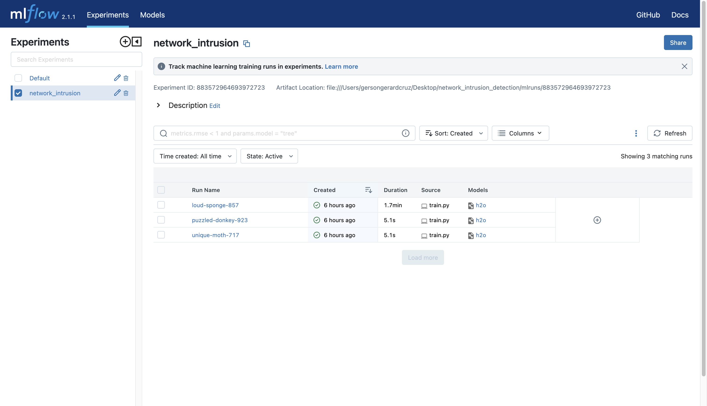
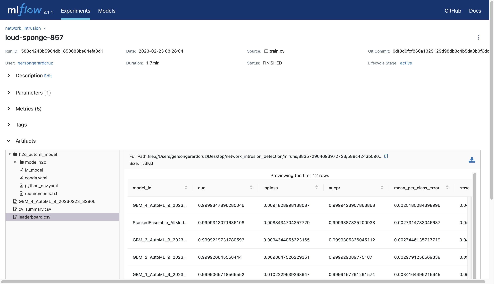

# End-to-End Network Intrusion Detection using AutoML, Mlflow, Streamlit, and FastAPI

## Project Information

Network intrusion detection is a critical aspect of cybersecurity that helps organizations safeguard their networks and sensitive data from cyber attacks. As more businesses and individuals rely on technology for daily operations and communication, the risk of cyber attacks becomes increasingly prevalent. Malicious actors use various techniques to exploit vulnerabilities in networks and gain unauthorized access to confidential information, which can result in financial loss and reputational damage. 

Network intrusion detection models serve as a powerful defense mechanism against these threats by monitoring network traffic and identifying potential security breaches. By providing early warning signals of potential attacks, these models allow security teams to take immediate action and prevent or mitigate the impact of a cyber attack. 

Given the importance of protecting sensitive data in today's digital landscape, network intrusion detection models are essential for maintaining the integrity and security of networks and systems. Thus, this is an **end-to-end deployment of a network intrusion classification model** trained on [Kaggle's Network Intrusion Detection Dataset](https://www.kaggle.com/datasets/sampadab17/network-intrusion-detection) using four key components: **AutoML, Mlflow, Streamlit, and FastAPI**. 

## Business Value

Businesses using network intrusion detection models can derive value by having: 
1. Improved security: By accurately identifying and flagging anomalous network activity, organizations can better protect themselves against potential cyber threats, such as malware, viruses, and hacking attempts.
2. Reduced downtime: Early detection of anomalous network activity can help prevent system crashes and other downtime events, improving overall system uptime and reducing potential losses in productivity and revenue.

3. Increased efficiency: By automating the process of network intrusion detection, organizations can reduce the need for manual review and analysis of network logs, freeing up time and resources for other business-critical tasks.

## Technical Value

The technical team can generate value from utilizing AutoML and Mlflow in the development of the network instruction model because of the following. 

### AutoML:

* Saves time and effort by automating the selection of the best algorithm and hyperparameters for the network intrusion detection model.
* Reduces the risk of human error in the model selection process by automating it.
* Increases the accuracy of the network intrusion detection model by optimizing the algorithm and hyperparameters for the dataset.

### Mlflow:

* Makes it easier to reproduce experiments and results by tracking the inputs, parameters, and metrics used in the network intrusion detection model.
* Enables effective collaboration and knowledge sharing among data scientists and engineers by providing a centralized repository for model experimentation and results.
* Provides version control for models and datasets, allowing for easy comparison and selection of the best model for deployment.
* Facilitates the deployment of the network intrusion detection model by generating deployable artifacts and providing an API for serving the model.

## Project Structure

    ├── README.md          <- The top-level documentation for this project.
    ├── data
    │   ├── processed      <- The final data sets for customer segmentation.
    │   ├── interim        <- Folder for holding data with intermediate transformations
    │   └── raw            <- The original, immutable datasets.
    ├── images             <- The media used in the README documentation
    ├── notebooks          <- Jupyter notebooks containing the explorations performed in this project
    ├── references         <- Folder containing relevant files for keeping track of trained models and features
    ├── requirements.txt   <- The requirements file for reproducing the project
    ├── src                <- Folder containing all source code in the project
    │   ├── backend        <- Folder for all files for setting up the backend 
    │   ├── frontend       <- Folder for all files for setting up the frontend

## Key Project Files

- `data/`: Folder containing all datasets (training, interim, processed). 
    - `train/`: Folder containing raw data taken from Kaggle
    - `processed/`: Folder containing for-training data after being preprocessed
- `notebooks`: Folder containing jupyter notebooks for the project
    - `01_eda.ipynb`: notebook performing eda and interim cleaning of raw data
- `references/`: Folder containing files for tracking models and features
    - `train_processed_column_types.json`: json file containing all columns and their respective types
    - `leaderboard.csv`: csv file for the ranking of models and their performance
    - `cv_summary.csv`: csv file containing information regarding cv-fold metrics of the best model
- `src`: Folder containing source code for both backend and frontend
    - `utils.py`: Python file containing all helper functions for preprocessing, training, and deployment
    - `backend/`: Folder containing all files for setting up the backend (preprocessing, AutoML training, FastAPI)
        - `preprocess.py`: Python file for performing preprocessing steps such as categorical encoding and numerical scaling 
        - `train.py`: Python file for performing AutoML training tracked using Mlflow
        - `main.py`: Python file containing FastAPI post request to make predictions and selecting the best trained model for it
    - `frontend/`: Folder containing all files for frontend components (Streamlit UI)
        - `app.py`: Python file for spinning up the Streamlit application for uploading test data, making predictions, and downloading predictions

## Project Instructions

### Setting up

To run the application, first create a virtual environment. I used [miniconda](https://docs.conda.io/en/latest/miniconda.html) as my virtual environment manager and create an environment with the following command: 

```python
conda create --name network_intrusion python=3.9
conda activate network_intrusion
```

The next step is to clone the repository in the virtual environment by running:

```python
HTTPS: git clone https://github.com/gersongerardcruz/network_intrusion_detection.git
```

```python
SSH: git clone git@github.com:gersongerardcruz/network_intrusion_detection.git
```

Then, move into the repository and install the requirements with:

```python
cd network_intrusion_detection
pip install -r requirements.txt
```

### Preprocessing

The github repository contains both raw and processed data already, however, should you wish to process a new subset of the data, run the command:

```python
src/backend/preprocess.py --input_path data/interim/train.csv --output_path data/processed/train.csv --target_column class --label_encoding protocol_type --binary_encoding service flag
```

where

- `--input_path`: path to input file
- `--output_path`: path to output file
- `--target_column`: name of target column
- `--label_encoding`: list of columns for label encoding
- `--binary_encoding`: list of columns for binary encoding

To preprocess test sets without any target columns, run the command: 

```python
src/backend/preprocess.py --input_path data/interim/train.csv --output_path data/processed/train.csv --target_column class --label_encoding protocol_type --binary_encoding service flag --no-train
```

where 

- `--no-train` suggests that the data is for the test set, thereby processing without a target column. 

Additional encoding methods such as `onehot-encoding` and `ordinal-encoding` can be added by modifying the code in `preprocess.py`

### Training

To train the model with H2O AutoML, run the command: 

```python
python src/backend/train.py --experiment_name network_intrusion --max_models 10 --target_column class --train_data data/processed/train.csv
```

where 

- `--experiment_name`: name of the experiment to log/create in mlflow
- `--max_models`: maximum number of models to train
- `--target_column`: name of target column
- `--train_data`: path to training data

This command will generate an `mlruns/` folder which contains the experiments, runs, and models created. It will also print out the locations of the `leaderboard.csv` and `best_model`. 

To track your experiments and models, run the command:

```python
mlflow ui --port 5001
```

This will give you a link to your local Mlflow server for tracking experiments and runs. The `--port 5001` is done to ensure that the port will be available because `port 5000` is usually used by local deployments. 

The Mlflow ui and a sample run are shown below.



 
### Deployment

To deploy the model and make predictions, open up two terminals. 

In the first terminal, while still being in the `network_intrusion_detection/` directory, run the command:

```python
uvicorn src.backend.main:app --reload
```

This will boot up the FastAPI backend which handles prediction. 

In the second terminal, again while still in the `network_intrusion_detection/` directory, run the command:

```python
streamlit run src/frontend/app.py  
```

This will spin up the Streamlit application which will allow the user to upload a dataset for prediction, perform prediction using the best trained model, and download the prediction results in the json format. 

### Demo

To see how to interact with the Streamlit UI, watch the gif demonstration below. <br>


## Conclusions

- The trained classification model was able to accurately classify network activity as 'normal' or 'anomalous', which has important business value for organizations that need to secure their networks against potential cyber attacks.
- AutoML with H2O was used to efficiently explore and select the best classification model, saving significant time and resources compared to manual model selection.
- Mlflow was used to track and log all the experiment runs, which made it easy to compare and reproduce models across different runs.
- By using FastAPI and Streamlit together, we can quickly build and deploy a web application for our network intrusion detection model without sacrificing speed, accuracy, or usability.
    - However, it is important to note that FastAPI and Streamlit may not be the best choice for all machine learning projects. Depending on the requirements and constraints of a given project, other tools and frameworks may be more suitable. Therefore, it is important to carefully evaluate the trade-offs of using FastAPI and Streamlit before committing to this approach.

## Recommendations

- Use a more comprehensive dataset with more metadata about the columns to better understand the nature of the data and improve the accuracy of the model.
- Evaluate the model's performance over time and update the model regularly to adapt to changing network behaviors and new types of cyber attacks.
- Package the model and deploy it in real-time via the cloud

## References

- Special thanks to [Kenneth Leung](https://kennethleungty.medium.com/) for his Medium article: https://towardsdatascience.com/end-to-end-automl-train-and-serve-with-h2o-mlflow-fastapi-and-streamlit-5d36eedfe606 
    - This article introduced me to the concept of AutoML. I learned a lot from it and applied those concepts to this project. I look forward to doing more end-to-end projects with AutoML. 
- https://docs.h2o.ai/h2o/latest-stable/h2o-docs/automl.html
- https://mlflow.org/docs/latest/index.html
- https://devdocs.io/fastapi/
- https://docs.streamlit.io/
- https://www.kaggle.com/datasets/sampadab17/network-intrusion-detection